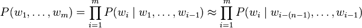
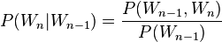
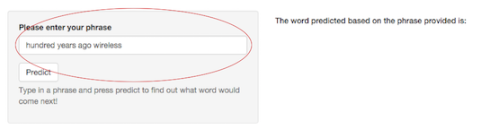
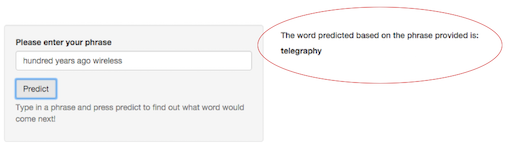

## Purpose

This [ShinyApp](https://bhudnall.shinyapps.io/nlp_capstone/) was created for the Data Science Capstone course offered through John Hopkins on Coursera. The premise behind the app
is to create a product to highlight a Natural Language Processing prediction algorithm built to provide an interface that can be accessed by others. 

This documentaion aims to:

1. Briefly explain how the predictive model works.
2. Summarize the performance of the algorithm.
3. Show the user how the product works.

--- .class #id 

## Data Model: Ngrams and Back-off model

1. The model used in the algorithm are multiple [n-gram](https://en.wikipedia.org/wiki/Wide_and_narrow_data) calculations. Ngrams are based on the chain rule of probability which explains that the probability of each event depends only on the state attained in the previous event. The chain rule of probability formula is: 
2. Within the model created, there are 4 difference ngrams used: bigram (two words), trigram (three words), quadgram (four words) and a pentagram (five words). Using bigrams as an example, the following is the conditional probability formula:.
3. The specific ngram used and output calculated is dependent on the number of words provided. 
4. When considering an ngram model and the number of words (context) provided. The more words given, the more accurace the model will be in predicting the ngram model to use. To do this, the model computes the number of words provided into the text entry area. From there, the model will then locate the most appropriate ngram to use. 

--- .class #id

## Performance

1. The data provided is comprised of text from tweets, news articles and blogs. The amount of text is extremely abundant. As a result, samples were taken from each source to account for computational restrictions -- in particular to processing. The number of characters within the final [corpus](https://en.wikipedia.org/wiki/Text_corpus) is 3,388,098 worth 3.2 MB worth of space.
2. Shiny applications rely on other technology for [persistent data storage](http://shiny.rstudio.com/articles/persistent-data-storage.html). As a result, SQLlite and specifically the RSQLite package was used to leverage a database. Within the database, there is a table for each ngram that is essentially a dataframe containing the ordered frequencies of each phrase. 
3. The result of leveraging sampling and a database is faster response time.

--- .class #id

## How to use

First enter the phrase into the text entry area:

From there, click predict and you will see the next word prediction in the output area: 

Thanks so much for taking the time to review! I look forward to receiving helpful feedback to improve the accuracy and efficiency of this application.

